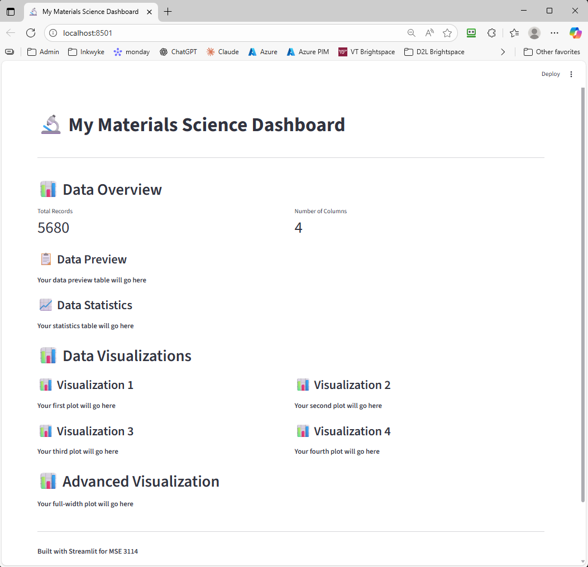

# Complete Step-by-Step Dashboard Setup Guide
## A Detailed Walkthrough for Building Your First Streamlit Dashboard Using Cursor

**Tools You'll Use:**
- 🖥️ **Cursor** - Your AI-powered code editor
- 🤖 **Cursor AI** - Your AI assistant for generating code
- 💻 **Cursor Terminal** - Built-in terminal for running commands
- 📊 **Streamlit** - Framework for building dashboards

---

## 📋 Table of Contents
1. [Before You Start: Opening Your Project in Cursor](#step-1-opening-your-project-in-cursor)
2. [Preparing Your Data](#step-2-preparing-your-data)
3. [Creating the Dashboard File](#step-3-creating-the-dashboard-file)
4. [Running Your First Dashboard](#step-4-running-your-first-dashboard)
5. [Adding the Data Preview Table](#step-5-adding-the-data-preview-table)
6. [Adding Visualizations with Cursor AI](#step-6-adding-visualizations-with-cursor-ai)
7. [Troubleshooting Common Issues](#step-7-troubleshooting-common-issues)

---

## 🎯 The Cursor Workflow at a Glance

Here's the complete workflow you'll follow:

```
1. Open Cursor → Open your Python-for-mse folder
                     ↓
2. Open Notebook → Run cells to prepare data → Creates dashboard_data.csv
                     ↓
3. Create my_dashboard.py → Paste skeleton code
                     ↓
4. Open Cursor Terminal (Ctrl+`) → Run: streamlit run my_dashboard.py
                     ↓
5. See basic dashboard in browser ✓
                     ↓
6. Open Cursor AI (Ctrl+L) → Ask for visualizations → AI generates code
                     ↓
7. Copy code into my_dashboard.py → Save (Ctrl+S)
                     ↓
8. Refresh browser → See new visualization ✓
                     ↓
9. Repeat steps 6-8 for more features!
```

**Key Cursor Features You'll Use:**
- 🖥️ **Explorer Panel** (left) - Navigate files
- ✏️ **Editor** (center) - Write/edit code  
- 🤖 **AI Chat** (right, `Ctrl+L`) - Get code suggestions
- 💻 **Terminal** (bottom, `` Ctrl+` ``) - Run commands

**Ready? Let's begin!**

---

## Step 1: Opening Your Project in Cursor

### 1.1: Launch Cursor

1. **Open Cursor** from your Start Menu or desktop
2. If this is your first time, you may need to sign in with your account

### 1.2: Open Your Project Folder

1. In Cursor, click **File → Open Folder** (or press `Ctrl+K` then `Ctrl+O`)
2. Navigate to your `Python-for-mse` folder
3. Click **Select Folder**

**Example path:**
```
C:\Users\[YourUsername]\Documents\Python-for-mse
```

### 1.3: Verify Your Folder Structure in Cursor

Once your folder is open, look at the **Explorer panel** on the left side of Cursor.

Your files MUST be organized exactly like this:

```
Python-for-mse/
├── lessons_3114/
│    ├── 03_AI_Assisted_Dashboard_week_6.ipynb
│    ├── my_dashboard.py (you will create this)
│    └── dashboard_data.csv (will be created by the notebook)
├── data_files/
│    ├── database/
│    │    ├── glass.json
│    │    ├── steels_yield.json
│    │    └── matbench_expt_is_metal.json
```

**How to verify:**
- In the Explorer panel (left sidebar), expand the folders
- ✅ You should see `lessons_3114` folder
- ✅ You should see `data_files` folder
- ✅ Inside `data_files`, you should see `database` folder
- ✅ Inside `database`, verify the three JSON files exist

**⚠️ Important:** If your folder structure is different, you'll need to adjust file paths later!

**✅ Checkpoint:** Cursor is open with your `Python-for-mse` folder loaded

---

## Step 2: Preparing Your Data

### 2.1: Open the Notebook in Cursor

1. **In Cursor's Explorer panel** (left sidebar), navigate to:
   ```
   lessons_3114/03_AI_Assisted_Dashboard_week_6.ipynb
   ```

2. **Click on the file** to open it

3. Cursor will display the notebook with all cells visible

**✨ Cursor Tip:** Cursor can run Jupyter notebooks directly! You'll see a "Run Cell" button above each code cell.

### 2.2: Select Your Python Environment

Before running cells, you need to select a Python kernel:

1. **Look at the top-right corner** of the notebook - you'll see "Select Kernel"
2. **Click "Select Kernel"**
3. **Choose your Python environment**:
   - If you use conda: Select your conda environment (e.g., "primary" or "base")
   - Otherwise: Select your Python installation

**✅ Checkpoint:** You should see your Python environment name displayed at the top right

### 2.3: Run the Data Preparation Cells

**How to run cells in Cursor:**
- Click the **▶ Run Cell** button that appears above the cell
- Or click inside the cell and press **Shift+Enter**

**Cell 1: Load Your Data**

Find this cell and click **▶ Run Cell**:

```python
import pandas as pd
import numpy as np
import matplotlib.pyplot as plt
import seaborn as sns
import json

# Option 1: Metallic glass formation database
with open('../data_files/database/glass.json', 'r') as f:
    glass_data = json.load(f)

# Process your data
variable_1 = []
variable_2 = []
for item in glass_data['data']:
    variable_1.append(item[0])
    variable_2.append(item[1])

# Create DataFrame
data = pd.DataFrame({
    'Composition': variable_1,
    'Glass_Forming': variable_2
})

print(f"Dataset loaded: {data.shape}")
print(f"Columns: {list(data.columns)}")
print("\nFirst few rows:")
data.head()
```

**Expected Output:**
```
Dataset loaded: (5680, 2)
Columns: ['Composition', 'Glass_Forming']
```

**⚠️ If you get an error here:** Check that your file path is correct. The `..` means "go up one folder level."

### 2.3: Add Features to Your Data

Run the cell that adds composition length and number of elements:

```python
# Add composition length column
data['Composition_Length'] = data['Composition'].str.len()

# Add number of elements column
import re
data['num_elements'] = data['Composition'].apply(lambda x: len(re.findall(r'[A-Z][a-z]?', x)))

# Check the new features
print("✅ Added new features:")
print(f"   - Composition_Length: range {data['Composition_Length'].min()} to {data['Composition_Length'].max()}")
print(f"   - num_elements: range {data['num_elements'].min()} to {data['num_elements'].max()}")

print(f"\nUpdated dataset shape: {data.shape}")
print(f"Updated columns: {list(data.columns)}")

# Export the updated data to a CSV file for dashboard use
data.to_csv('dashboard_data.csv', index=False)
print("✅ Data exported to dashboard_data.csv")
```

**Expected Output:**
```
✅ Added new features:
   - Composition_Length: range 2 to 21
   - num_elements: range 1 to 3

Updated dataset shape: (5680, 4)
Updated columns: ['Composition', 'Glass_Forming', 'Composition_Length', 'num_elements']

✅ Data exported to dashboard_data.csv
```

### 2.4: Verify the CSV File Was Created

**Check in Cursor's Explorer:**
1. Look at the **Explorer panel** on the left side of Cursor
2. Navigate to the `lessons_3114` folder
3. You should now see a file called `dashboard_data.csv`
4. If you don't see it:
   - Right-click in the Explorer → **Refresh Explorer**
   - Or re-run the cell above

**✅ Checkpoint:** You now have your data prepared and saved as `dashboard_data.csv`

---

## Step 3: Creating the Dashboard File

### 3.1: Create a New Python File in Cursor

1. **In Cursor**, make sure you're viewing the `lessons_3114` folder in the Explorer panel

2. **Right-click on the `lessons_3114` folder** in the Explorer panel

3. **Select "New File"**

4. **Type the filename:** `my_dashboard.py`
   - Make absolutely sure it ends with `.py`
   - Press **Enter**

5. **The file opens automatically** in Cursor's editor

**✨ Cursor Tip:** The file should appear in your Explorer panel under `lessons_3114/` and open in the main editor area.

### 3.2: Copy the Dashboard Skeleton Code

**Open `my_dashboard.py` and paste this code:**

```python
import streamlit as st
import pandas as pd
import plotly.express as px
import plotly.graph_objects as go

# Page configuration
st.set_page_config(
    page_title="My Materials Science Dashboard",
    page_icon="🔬",
    layout="wide"
)

# Title and header
st.title("🔬 My Materials Science Dashboard")
st.markdown("---")

# Load data
@st.cache_data
def load_data():
    return pd.read_csv("dashboard_data.csv")

data = load_data()

# Data overview section
st.header("📊 Data Overview")
col_info1, col_info2 = st.columns(2)
with col_info1:
    st.metric("Total Records", len(data))
with col_info2:
    st.metric("Number of Columns", len(data.columns))

# TODO: Add your data preview table here
st.subheader("📋 Data Preview")
st.write("**Your data preview table will go here**")

# TODO: Add your statistics table here
st.subheader("📈 Data Statistics")
st.write("**Your statistics table will go here**")

# Visualizations section
st.header("📊 Data Visualizations")

# Create visualization grid
col1, col2 = st.columns(2)

with col1:
    st.subheader("📊 Visualization 1")
    st.write("**Your first plot will go here**")

with col2:
    st.subheader("📊 Visualization 2")
    st.write("**Your second plot will go here**")

col3, col4 = st.columns(2)

with col3:
    st.subheader("📊 Visualization 3")
    st.write("**Your third plot will go here**")

with col4:
    st.subheader("📊 Visualization 4")
    st.write("**Your fourth plot will go here**")

# Full-width visualization
st.header("📊 Advanced Visualization")
st.write("**Your full-width plot will go here**")

# Footer
st.markdown("---")
st.markdown("**Built with Streamlit for MSE 3114**")
```

### 3.3: Save the File

- **In Cursor:** Press `Ctrl+S` (Windows) or `Cmd+S` (Mac)
- **Verify it saved:** You should see the tab name without an asterisk (*) or dot

**✅ Checkpoint:** You now have a `my_dashboard.py` file in your `lessons_3114` folder with the skeleton code

---

## Step 4: Running Your First Dashboard

### 4.1: Open Cursor's Built-in Terminal

**Cursor has a built-in terminal - no need for a separate window!**

**To open the terminal in Cursor:**

**Method 1:** Press `` Ctrl+` `` (that's Ctrl and the backtick/grave accent key, usually above Tab)

**Method 2:** Go to the menu: **View → Terminal**

**Method 3:** Press `Ctrl+Shift+P` to open Command Palette, type "terminal", select "View: Toggle Terminal"

**What you should see:**
- A terminal panel appears at the bottom of Cursor
- It shows your current directory path
- You can type commands here

**✨ Cursor Tip:** The terminal automatically opens in your project folder!


### 4.2: Verify You're in the Correct Folder

**In the Cursor terminal, type:**

```bash
cd lessons_3114
```

Then press **Enter**.

**To confirm you're in the right place:**
```bash
dir
```

You should see:
- `03_AI_Assisted_Dashboard_week_6.ipynb`
- `my_dashboard.py`
- `dashboard_data.csv`

**If you don't see these files**, navigate to the correct folder:
```bash
cd "C:\Users\[YourUsername]\Documents\Python-for-mse\lessons_3114"
```

**✅ Checkpoint:** Cursor terminal is open and you're in the `lessons_3114` folder

### 4.3: Install Streamlit (If Not Already Installed)

**In the Cursor terminal, check if Streamlit is installed:**
```bash
streamlit --version
```

**If you see a version number** (e.g., "Streamlit, version 1.28.0"), you're good! Skip to Step 4.4.

**If you get an error, install Streamlit:**

**If you use conda (recommended):**
```bash
conda install -c conda-forge streamlit
```

**If you use pip:**
```bash
pip install streamlit
```

**Wait for installation to complete.** This may take a few minutes.

### 4.4: Run Streamlit

**In the Cursor terminal, type:**

```bash
streamlit run my_dashboard.py
```

Then press **Enter**.

**What should happen:**

1. You'll see text in the terminal like:
   ```
   You can now view your Streamlit app in your browser.
   Local URL: http://localhost:8501
   Network URL: http://192.168.x.x:8501
   ```

2. **Your web browser should automatically open** showing your dashboard!

3. **If it doesn't open automatically:**
   - Hold **Ctrl** and **click** the `http://localhost:8501` link in the Cursor terminal
   - Or manually open your web browser and go to: `http://localhost:8501`

**✨ Cursor Tip:** Leave the terminal running! Don't close it or the dashboard will stop.

### 4.5: What You Should See

Your basic dashboard should display with:
- ✅ A title: "🔬 My Materials Science Dashboard"
- ✅ Two metrics showing Total Records (5680) and Number of Columns (4)
- ✅ Placeholder text for tables and visualizations



**✅ Checkpoint:** Your dashboard is running! Now let's add real content.

### 4.6: Stopping the Dashboard

When you want to stop the dashboard:
- **Click in the Cursor terminal** (bottom panel)
- Press **`Ctrl+C`**
- This stops the Streamlit server
- The terminal prompt will return (you can type commands again)

---

## Step 5: Adding the Data Preview Table

### 5.1: Understanding What We're Adding

We're going to replace the placeholder text "Your data preview table will go here" with a real Plotly table that shows the first 5 rows of your data.

### 5.2: Stop Your Dashboard (If Running)

- **Click in the Cursor terminal** (bottom panel)
- Press `Ctrl+C` to stop the dashboard

### 5.3: Edit my_dashboard.py in Cursor

**In Cursor, open `my_dashboard.py`** (it should already be open in a tab, or click it in the Explorer panel)

**Find these lines in your file:**

```python
# TODO: Add your data preview table here
st.subheader("📋 Data Preview")
st.write("**Your data preview table will go here**")
```

**Replace them with:**

```python
# Data preview table
st.subheader("📋 Data Preview")

# Create data preview table
fig = go.Figure(data=[go.Table(
    header=dict(
        values=list(data.columns),
        fill_color='lightblue',
        align='left',
        font=dict(size=12, color='black')
    ),
    cells=dict(
        values=[data[col].head(5) for col in data.columns],
        fill_color='lightgray',
        align='left',
        font=dict(size=11, color='black')
    )
)])

fig.update_layout(
    title='Data Preview (First 5 Rows)',
    height=300
)

st.plotly_chart(fig, use_container_width=True)
```

### 5.4: Understanding the Code

Let's break down what this code does:

- **`go.Figure(data=[go.Table(...)])`**: Creates a Plotly table figure
- **`header=dict(...)`**: Defines the table headers (column names)
  - `values=list(data.columns)`: Uses your actual column names
  - `fill_color='lightblue'`: Makes headers light blue
- **`cells=dict(...)`**: Defines the table content
  - `values=[data[col].head(5) for col in data.columns]`: Shows first 5 rows
  - `fill_color='lightgray'`: Makes cells light gray
- **`st.plotly_chart(fig, use_container_width=True)`**: **CRITICAL!** This line actually displays the table
  - Without this line, the table won't appear!

### 5.5: Save and Test

1. **Save the file:** `Ctrl+S`
2. **Run the dashboard again:**
   ```bash
   streamlit run my_dashboard.py
   ```
3. **Check your browser** - you should now see a beautiful table with your data!

**✅ Checkpoint:** Your dashboard now shows a real data preview table!

---

## Step 6: Adding Visualizations with Cursor AI

Now we'll use **Cursor's AI assistant** to help generate visualization code! This is where Cursor really shines.

### 6.1: Opening Cursor AI Chat

**To open the AI chat in Cursor:**

**Method 1:** Press `Ctrl+L` (or `Cmd+L` on Mac)

**Method 2:** Click the **chat icon** (💬) in the right sidebar

**What you should see:**
- A chat panel appears on the right side of Cursor
- You can type questions or requests to the AI

**✨ Cursor AI Tip:** The AI can see your open files and understand your project structure!

### 6.2: Using Cursor AI to Generate a Histogram

Let's ask Cursor AI to create a histogram for us.

### 6.3: Stop Your Dashboard (If Running)

- **Click in the Cursor terminal**
- Press `Ctrl+C`

### 6.4: Ask Cursor AI for Help

**In the Cursor AI chat, type this prompt:**

```
I need a histogram for my Streamlit dashboard in my_dashboard.py file.

My dataframe has a column called 'Composition_Length' with numeric values.
I want to add this to the "Visualization 2" section (col2).

Please give me the exact Plotly code that:
- Creates a histogram with 20 bins
- Has a title 'Distribution of Composition Length'
- Uses sky blue bars with black edges
- Uses the variable name 'data' for my dataframe
- Make sure to use st.plotly_chart(fig, use_container_width=True)
- All code must be properly indented under "with col2:"

Show me exactly what to replace in my file.
```

**Press Enter** and wait for the AI to respond.

### 6.5: Review the AI's Suggestion

Cursor AI will:
1. **Show you the code** to add
2. **Highlight where to add it** in your file
3. Possibly show a "Apply" button to automatically insert the code

**✨ Cursor AI Tip:** If the AI suggests code, you can:
- Click **"Apply"** to automatically insert it
- Or **manually copy and paste** the code

### 6.6: Manually Add the Histogram Code

If you prefer to add it manually, **find these lines in `my_dashboard.py`:**

```python
with col2:
    st.subheader("📊 Visualization 2")
    st.write("**Your second plot will go here**")
```

**Replace them with:**

```python
with col2:
    st.subheader("📊 Composition Length Distribution")
    
    # Create histogram
    fig = px.histogram(
        data, 
        x='Composition_Length',
        nbins=20,
        title='Distribution of Composition Length',
        color_discrete_sequence=['skyblue']
    )

    # Update bar edges to black
    fig.update_traces(
        marker=dict(
            line=dict(color='black', width=1)
        )
    )

    fig.update_layout(
        xaxis_title='Composition Length',
        yaxis_title='Count',
        showlegend=False
    )
    
    st.plotly_chart(fig, use_container_width=True)
```

### 6.4: ⚠️ CRITICAL: Indentation

**The code MUST be indented under `with col2:`**

**✅ Correct:**
```python
with col2:
    st.subheader("📊 Composition Length Distribution")
    
    fig = px.histogram(...)  # <-- Indented with 4 spaces
    st.plotly_chart(fig, use_container_width=True)  # <-- Indented
```

**❌ Wrong:**
```python
with col2:
    st.subheader("📊 Composition Length Distribution")
    
fig = px.histogram(...)  # <-- NOT indented - will appear in wrong place!
st.plotly_chart(fig, use_container_width=True)
```

### 6.5: Understanding the Code

- **`px.histogram(...)`**: Creates a histogram using Plotly Express
- **`x='Composition_Length'`**: Uses the Composition_Length column
- **`nbins=20`**: Divides the data into 20 bins
- **`color_discrete_sequence=['skyblue']`**: Makes bars sky blue
- **`fig.update_traces(marker=dict(line=dict(color='black', width=1)))`**: Adds black edges
- **`st.plotly_chart(fig, use_container_width=True)`**: **MUST HAVE THIS LINE!** Displays the plot

### 6.6: Save and Test

1. **Save:** `Ctrl+S`
2. **Run:**
   ```bash
   streamlit run my_dashboard.py
   ```
3. **Check:** You should see a histogram in the second column!

### 6.7: Using Cursor AI for More Visualizations

**Now let's add more charts using Cursor AI!**

**For a Pie Chart (Visualization 1):**

**Ask Cursor AI:**
```
Add a pie chart to col1 in my_dashboard.py that shows the distribution of the 'Glass_Forming' column (True/False values). Use plotly and make it display with st.plotly_chart(fig, use_container_width=True).
```

**For a Bar Chart (Visualization 3):**

**Ask Cursor AI:**
```
Add a bar chart to col3 in my_dashboard.py that shows the count of compositions by number of elements (num_elements column). Use plotly and make sure it displays with st.plotly_chart(fig, use_container_width=True).
```

**✨ Cursor AI Tips for Better Results:**

1. **Be specific** about:
   - Which file (`my_dashboard.py`)
   - Which section (`col1`, `col2`, etc.)
   - Column names (`'Glass_Forming'`, `'num_elements'`)
   - The display command (`st.plotly_chart(fig, use_container_width=True)`)

2. **If the AI makes a mistake:**
   - Type: "That's not quite right. Please make sure the code is indented under 'with col1:'"
   - Or: "Please add the st.plotly_chart() line at the end"

3. **You can ask for variations:**
   - "Make the bars a different color"
   - "Add axis labels"
   - "Change the title"

### 6.8: Alternative - Copy Code from the Notebook

If Cursor AI isn't working or you prefer, you can also:

1. **Go back to the notebook** `03_AI_Assisted_Dashboard_week_6.ipynb`
2. **Find the example code cells** with visualizations
3. **Copy the code** and paste it into your `my_dashboard.py`
4. **Make sure to indent properly** under the `with col1:` statements

**✅ Checkpoint:** Your dashboard now has multiple visualizations!

---

## Step 7: Troubleshooting Common Issues

### Issue 1: "streamlit is not recognized as a command"

**Problem:** Streamlit is not installed

**Solution:**
```bash
pip install streamlit
```

Or:
```bash
conda install -c conda-forge streamlit
```

Then try running your dashboard again.

---

### Issue 2: "No such file or directory: 'dashboard_data.csv'"

**Problem:** The dashboard can't find your data file

**Possible Causes:**

1. **You didn't run the notebook cells** that create `dashboard_data.csv`
   - **Solution:** Go back to Step 2 and run all cells in the notebook

2. **Your terminal is in the wrong folder**
   - **Solution:** Make sure you're in the `lessons_3114` folder:
     ```bash
     cd "C:\Users\[YourUsername]\Documents\Python-for-mse\lessons_3114"
     ```

3. **The CSV file is in a different location**
   - **Solution:** Check File Explorer - is `dashboard_data.csv` in the same folder as `my_dashboard.py`?

---

### Issue 3: "Table/Plot Not Showing Up"

**Problem:** You added code but nothing appears on the dashboard

**Most Common Cause:** You forgot the display line!

**Solution:** Make sure EVERY figure has this line at the end:
```python
st.plotly_chart(fig, use_container_width=True)
```

**Example of what's needed:**
```python
# Create the figure
fig = px.histogram(data, x='Composition_Length')

# Update the figure styling
fig.update_layout(title='My Histogram')

# THIS LINE IS REQUIRED to actually show the figure!
st.plotly_chart(fig, use_container_width=True)
```

---

### Issue 4: "Dashboard Not Updating with My Changes"

**Problem:** You edited the code but the dashboard looks the same

**Solutions:**

1. **Refresh your browser** - Press `R` on your keyboard while on the dashboard page

2. **Or hard refresh** - Press `Ctrl+Shift+R` (Windows) or `Cmd+Shift+R` (Mac)

3. **Or restart Streamlit:**
   - Terminal: Press `Ctrl+C`
   - Run again: `streamlit run my_dashboard.py`

4. **Enable auto-rerun:**
   - In your browser, click the hamburger menu (≡) in the top right
   - Click "Settings"
   - Turn on "Run on save"

---

### Issue 5: "Visualizations Appear Full Width Instead of in Columns"

**Problem:** Your charts don't stay in the column layout

**Cause:** Indentation is wrong

**Solution:** Make sure ALL code is indented under the `with col1:` statement:

**✅ Correct:**
```python
with col1:
    st.subheader("📊 My Plot")
    fig = px.histogram(data, x='Composition_Length')
    st.plotly_chart(fig, use_container_width=True)

with col2:
    st.subheader("📊 Another Plot")
    fig = px.pie(data, names='Glass_Forming')
    st.plotly_chart(fig, use_container_width=True)
```

**❌ Wrong:**
```python
with col1:
    st.subheader("📊 My Plot")

fig = px.histogram(data, x='Composition_Length')  # Not indented!
st.plotly_chart(fig, use_container_width=True)    # Not indented!
```

---

### Issue 6: "SyntaxError" or "IndentationError"

**Problem:** Python shows an error about syntax or indentation

**Common Causes:**

1. **Mixed tabs and spaces** - Python is very picky!
   - **Solution:** Use only spaces (4 spaces per indent level)
   - In Cursor: Press `Ctrl+Shift+P`, type "indent", select "Convert Indentation to Spaces"

2. **Missing colon (`:`)** after `with col1` or `if` statements
   - **Solution:** Make sure lines like `with col1:` end with `:`

3. **Unmatched parentheses** - every `(` needs a `)`
   - **Solution:** Cursor highlights matching pairs when you click on a bracket

**✨ Cursor AI Tip:** You can ask Cursor AI to fix syntax errors! Just paste the error message and ask "How do I fix this error?"

---

### Issue 7: "Cannot Find Terminal in Cursor"

**Solution: Opening Cursor's Built-in Terminal**

**Method 1:** Press `` Ctrl+` `` (that's Ctrl and the backtick/grave accent key, usually above Tab)

**Method 2:** Menu → **View → Terminal**

**Method 3:** 
1. Press `Ctrl+Shift+P` (Command Palette)
2. Type "terminal"
3. Select "View: Toggle Terminal"

**What you should see:**
- A terminal panel appears at the bottom of Cursor
- It shows your current directory path

**If the terminal panel appears but is empty:**
- Click in it
- Start typing commands

**✨ Cursor Tip:** You can have multiple terminals! Click the **+** button in the terminal panel to open another one.

---

### Issue 8: "Dashboard Loads But Shows Wrong Data"

**Problem:** Dashboard shows data but it's not what you expected

**Possible Causes:**

1. **Using the wrong CSV file**
   - **Solution:** Check that you ran the notebook cells to create fresh data

2. **Data got corrupted**
   - **Solution:** Delete `dashboard_data.csv` and re-run the notebook cells to create a new one

3. **Cached data**
   - **Solution:** In your dashboard, click hamburger menu (≡) → Clear cache

---

## 🎉 Success Checklist

By the end of this guide, you should have:

- ✅ Correct folder structure with all files in the right places
- ✅ `dashboard_data.csv` created from the notebook
- ✅ `my_dashboard.py` file created with the skeleton code
- ✅ Streamlit installed and working
- ✅ Dashboard running at `http://localhost:8501`
- ✅ Data preview table showing your first 5 rows
- ✅ At least one visualization (histogram) displaying correctly
- ✅ Understanding of how to add more visualizations

---

## 🆘 Still Having Trouble?

### Pre-Flight Checklist - Run These Commands

Open your terminal and run each command. Write down any errors you see:

```bash
# Check Python is installed
python --version

# Check Streamlit is installed
streamlit --version

# Check if you're in the right directory
cd "C:\Users\[YourUsername]\Documents\Python-for-mse\lessons_3114"

# List files in current directory
dir   # Windows
ls    # Mac/Linux

# Check if your files exist
dir dashboard_data.csv   # Should show the file
dir my_dashboard.py      # Should show the file
```

### Getting Help

If you're still stuck:

1. **Try Cursor AI first:**
   - Open Cursor AI chat (`Ctrl+L`)
   - Paste your error message
   - Ask: "I'm getting this error in my Streamlit dashboard. How do I fix it?"

2. **Write down the EXACT error message** you see

3. **Note which step you're stuck on**

4. **Take a screenshot if possible**

5. **Ask your instructor or TA** with this information

**✨ Cursor AI is often the fastest way to solve problems!** It can see your code and give you specific solutions.

---

## 📚 Quick Reference

### Essential Cursor Keyboard Shortcuts

```
Open AI Chat:               Ctrl+L
Open Terminal:              Ctrl+` (backtick)
Command Palette:            Ctrl+Shift+P
Save File:                  Ctrl+S
Find in File:               Ctrl+F
Toggle Sidebar:             Ctrl+B
Split Editor:               Ctrl+\
```

### Essential Cursor Terminal Commands

```bash
# Navigate to lessons folder
cd lessons_3114

# Run your dashboard
streamlit run my_dashboard.py

# Stop the dashboard
Ctrl+C

# Check Streamlit version
streamlit --version

# List files in current folder
dir         # Windows
ls          # Mac/Linux

# Check current directory
cd          # Shows your current location
```

### Using Cursor AI Effectively

**Good prompts for Cursor AI:**
- "Add a [type of chart] to [section] in my_dashboard.py using the [column name] column"
- "Fix this error: [paste error message]"
- "Explain what this code does: [paste code]"
- "How do I change the color of this plot?"

**Things to include in your prompts:**
- ✅ The specific file name (`my_dashboard.py`)
- ✅ The section/location (`col1`, `col2`, etc.)
- ✅ Column names from your data
- ✅ What library to use (`plotly`, `streamlit`)
- ✅ How to display it (`st.plotly_chart(fig, use_container_width=True)`)

### Essential Code Patterns

**Display a table:**
```python
fig = go.Figure(data=[go.Table(...)])
st.plotly_chart(fig, use_container_width=True)  # Required!
```

**Display a histogram:**
```python
fig = px.histogram(data, x='column_name')
st.plotly_chart(fig, use_container_width=True)  # Required!
```

**Display in a column:**
```python
with col1:
    st.subheader("Title")
    # All your code here must be indented
    fig = px.histogram(data, x='column_name')
    st.plotly_chart(fig, use_container_width=True)
```

---

## 🎓 Next Steps

Once your basic dashboard is working:

1. **Add more visualizations** - Ask Cursor AI to generate different chart types
2. **Add a statistics table** - Ask Cursor AI: "Add a statistics table showing data.describe() results"
3. **Customize colors and styles** - Ask Cursor AI: "Change the histogram to use different colors"
4. **Add filters** - Ask Cursor AI: "Add a sidebar filter for the num_elements column"
5. **Try a different dataset** - Use `steels_yield.json` or `matbench_expt_is_metal.json`

### 🤖 Advanced Cursor AI Usage

**Ask Cursor AI to help with:**

- **Debugging:** "Why isn't my histogram showing up? Here's my code: [paste code]"
- **Optimization:** "How can I make my dashboard load faster?"
- **Styling:** "Make my dashboard look more professional"
- **New features:** "Add a download button so users can export the data"
- **Documentation:** "Add comments explaining what this code does"

### ✨ Cursor Pro Tips

1. **Use `@filename` in chat** to reference specific files:
   ```
   @my_dashboard.py add a scatter plot to col4
   ```

2. **Select code and ask about it:**
   - Highlight code in your file
   - Press `Ctrl+L` to open chat
   - Ask: "What does this code do?" or "How can I improve this?"

3. **Use Cursor for debugging:**
   - Copy error messages
   - Paste them in Cursor AI chat
   - Ask: "How do I fix this error?"

4. **Iterate with AI:**
   - First prompt: "Add a bar chart"
   - Follow-up: "Change the colors to blue and green"
   - Follow-up: "Add axis labels"

---

**Remember:** Building a dashboard is an iterative process. Use Cursor AI as your coding partner - it can help you at every step! Start simple, test often, and add features one at a time!

**Good luck! 🚀**

